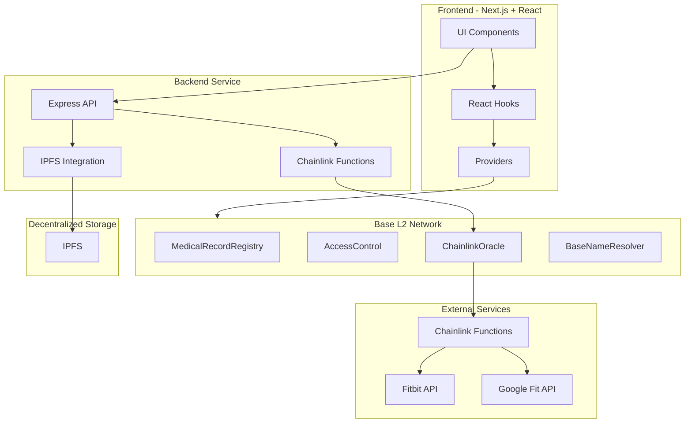

# Medilocker: Decentralized Medical Data Vault

Medilocker is a secure, decentralized platform for storing and sharing medical records, built on the Base L2 network. It combines encrypted off-chain storage with tamper-proof blockchain hashing to provide a secure yet accessible medical data management solution.

## Features

- **End-to-End Encryption**: All medical records are encrypted using AES-256 before being stored on IPFS.
- **Blockchain Verification**: SHA-256 content hashes are stored on Base L2 for tamper-proof integrity verification.
- **Granular Access Control**: Patients can grant and revoke access to specific doctors with NFT-based permissions.
- **Health Metrics Integration**: Automatically fetch and record health data from Fitbit and Google Fit via Chainlink Functions.
- **User-Friendly Interface**: Human-readable Basenames (`alice.base`) for identity and gasless onboarding with Coinbase Smart Wallet.

## Architecture



## Project Structure

```
medilocker/
├── packages/
│   ├── contracts/              # Smart contracts (Solidity)
│   │   ├── contracts/          # Smart contract source code
│   │   ├── scripts/            # Deployment scripts
│   │   └── test/               # Contract tests
│   │
│   ├── frontend/               # Next.js frontend application
│   │   ├── public/             # Static assets
│   │   └── src/                # Source code
│   │       ├── app/            # Next.js app router
│   │       ├── components/     # React components
│   │       ├── hooks/          # Custom React hooks
│   │       ├── services/       # Services for API/blockchain interaction
│   │       └── utils/          # Utility functions
│   │
│   ├── backend/                # Node.js backend service
│   │   ├── src/
│   │   │   ├── routes/         # API routes
│   │   │   ├── services/       # Service layer
│   │   │   └── middlewares/    # Express middlewares
│   │   └── abis/               # Contract ABIs
│   │
│   └── scripts/                # Utility scripts
│
└── README.md                   # Project documentation
```

## Getting Started

### Prerequisites

- Node.js (v16+)
- Yarn or npm
- MetaMask or Coinbase Wallet
- Base L2 network configured in your wallet

### Installation

1. Clone the repository:
   ```bash
   git clone https://github.com/your-username/medilocker.git
   cd medilocker
   ```

2. Install dependencies:
   ```bash
   yarn install
   ```

3. Set up environment variables:
   ```bash
   cp packages/contracts/.env.example packages/contracts/.env
   cp packages/backend/.env.example packages/backend/.env
   cp packages/frontend/.env.example packages/frontend/.env
   ```

4. Edit the `.env` files with your own configuration values.

### Development

1. Run the frontend development server:
   ```bash
   cd packages/frontend
   yarn dev
   ```

2. Run the backend development server:
   ```bash
   cd packages/backend
   yarn dev
   ```

3. Deploy contracts to a local network:
   ```bash
   cd packages/contracts
   yarn hardhat node
   yarn hardhat run scripts/deploy.js --network localhost
   ```

### Deployment

1. Deploy smart contracts to Base testnet:
   ```bash
   cd packages/contracts
   yarn deploy:testnet
   ```

2. Build and deploy the frontend:
   ```bash
   cd packages/frontend
   yarn build
   # Deploy to your hosting provider
   ```

3. Deploy the backend service:
   ```bash
   cd packages/backend
   yarn build
   # Deploy to your hosting provider
   ```

## Testing

Run tests for smart contracts:
```bash
cd packages/contracts
yarn test
```

Run tests for frontend components:
```bash
cd packages/frontend
yarn test
```

Run tests for backend services:
```bash
cd packages/backend
yarn test
```

## Demo Plan

### Video Demo Script (1 minute)

1. **Intro (10s)**: Brief introduction to Medilocker and its purpose
2. **Upload Flow (15s)**: Show the process of encrypting and uploading a medical record
3. **Access Control (15s)**: Demonstrate granting access to a doctor
4. **Health Metrics (10s)**: Show how health metrics are fetched and displayed
5. **Conclusion (10s)**: Summary of benefits and call to action

### Transaction Proofs

- Medical Record Storage: `0x...`
- Access Grant Transaction: `0x...`
- Chainlink Functions Request: `0x...`

## License

This project is licensed under the MIT License - see the LICENSE file for details.

## Acknowledgments

- Built on Base L2 network
- Powered by Chainlink Functions for oracle services
- IPFS integration for decentralized storage
- Coinbase OnchainKit for wallet and user experience 